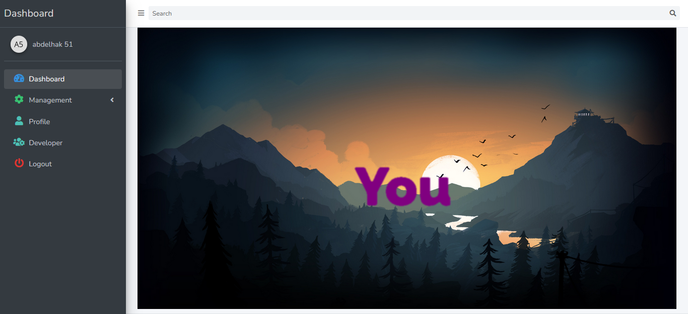
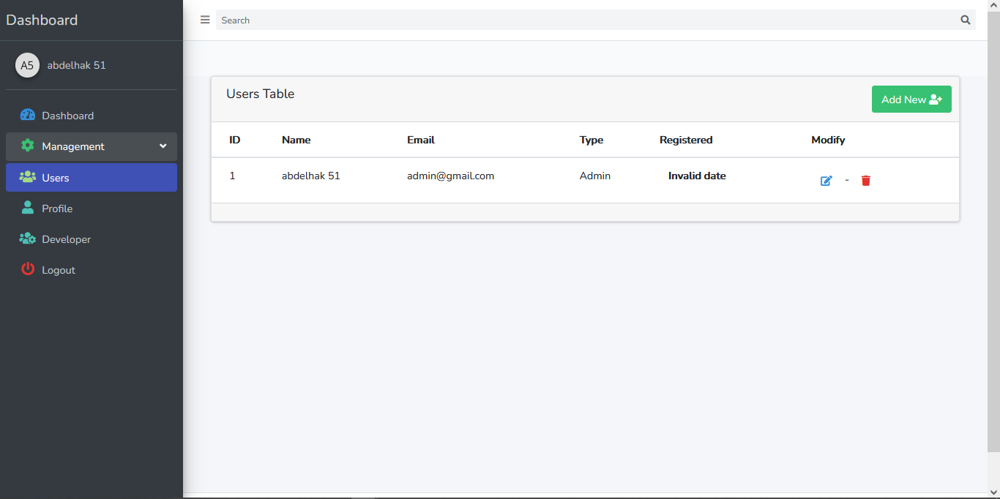
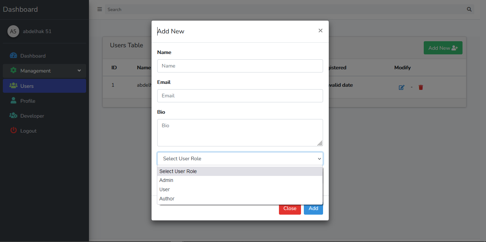

## This file give steps to run this website 

## Steps

 - [download the folder  and go to the root of the folder].
 - [type this cmd (composer install) ].
 - [type this cmd (npm install)].
 - [type this cmd (copy .env.example   .env)].
 - [type this cmd (php artisan key:generate)].
 - [modify the database information in the .env file to yours].
 - [type this cmds (php artisan cache:clear)].
 - [type this cmd (php artisan config:cache)].
 - [type this cmd (php artisan route:clear)].
 - [type this cmd (php artisan migrate)].
 - [type this cmd (php artisan db:seed)].

## Login information :  
   - [ /login   to access the dashboard as admin enter  (mail : admin@gmail.com, password : password)].

## Note
  - [this website uses laravel passport so make sure it is installed].
  - [dashboard for both user and admin access made using laravel and vuejs in a simple way you can add other features].

## From abdelhak  !!!  

